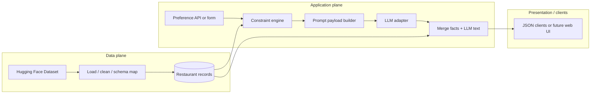
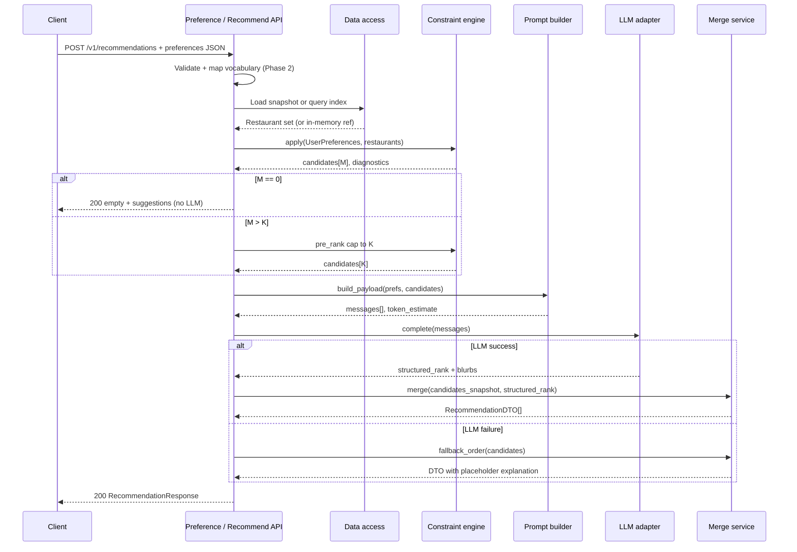
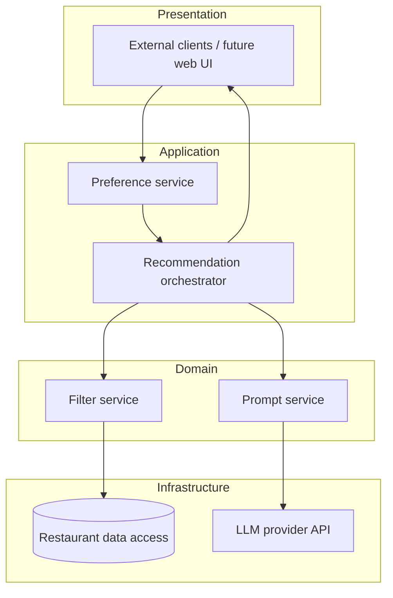
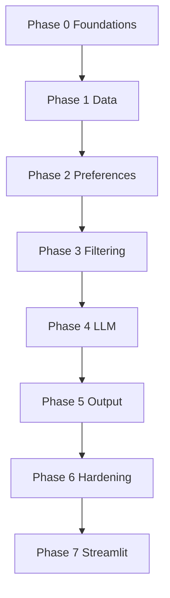

# Phase-Wise Architecture: AI-Powered Restaurant Recommendations (Detailed)

This document extends the goals and workflow in [problemStratement.md](./problemStratement.md) into a **phased build plan**, a **reference architecture**, and **implementation-level contracts**. It is the engineering counterpart to the product brief; for failure-mode detail see [edge-cases.md](./edge-cases.md).

---

## Document map

| Document | Purpose |
|----------|---------|
| [problemStratement.md](./problemStratement.md) | Product problem, workflow §1–5, success criteria |
| **phase-wise-architecture.md** (this file) | Phases, components, data contracts, runtime behavior |
| [edge-cases.md](./edge-cases.md) | Triggers, severities, acceptance notes, tests |

**As-built stack:** [§17](#17-as-built-backend-and-frontend) maps the **Python backend**; [§17.2](#172-frontend-and-api-clients) is the **Next.js** UI under `frontend/`. **Streamlit (Phase 7):** [§16](#16-phase-7-streamlit-deployment).

---

## 1. Architectural principles

These principles resolve trade-offs when the problem statement allows flexibility.

1. **Dataset is source of truth** — Names, ratings, cost, location, and cuisines shown to the user **must** come from normalized store rows keyed by stable `id`. The LLM ranks and narrates; it does not invent facts.
2. **Filter first, narrate second** — Hard constraints (location, budget, cuisine, minimum rating) are applied **deterministically** before any LLM call, except when you explicitly define a “wide search” product mode (see Phase 2).
3. **Bounded LLM context** — Only a capped shortlist (*K* rows, compact fields) is sent to the model. Token budget is a first-class constraint (§8).
4. **Grounded outputs** — LLM output is parsed and validated against the candidate id set; orphans are dropped before merge (aligns with edge cases **L4**, **L5** in [edge-cases.md](./edge-cases.md)).
5. **Reproducibility where possible** — Log model id, temperature, prompt template version, and `request_id` so behavior can be explained and regression-tested (problem statement success criteria).
6. **Graceful degradation** — If the LLM fails, the user still sees **ranked facts** with fallback explanations (Phases **4–5**); structured traces capture provider health (Phase **6**).

---

## 2. Logical architecture (data flow)

One-way pipeline: **HF → ETL → Store → Filter → Prompt payload → LLM → Merge → Output**. No feedback from LLM into the filter in v1 (keeps grounding simple).



---

## 3. Runtime: synchronous recommendation sequence

Typical **HTTP request** lifecycle (single process). Durations are illustrative for capacity planning.



**Correlation:** Every response should include or log a **`request_id`** (UUID) attached to filter diagnostics and LLM metadata (Phase 6).

---

## 4. Layered (C4-style) responsibility split



| Layer | Owns | Must not own |
|-------|------|----------------|
| **Presentation** | Forms, validation UX, loading/error UI, accessibility | Business filtering rules |
| **Application** | Orchestration, `request_id`, error taxonomy, timeouts | Raw HF parsing details |
| **Domain** | Filter semantics, pre-rank, prompt assembly, merge rules | HTTP status code policy (thin adapter can map) |
| **Infrastructure** | HF I/O, file cache, LLM HTTP client, retries | User-facing copy |

In **this repository**, the **Presentation** layer is not only the Next.js app: it is **any HTTP client** of `POST /v1/recommendations` (see **§17**), plus an optional **Streamlit** shell prescribed in **§16**. The FastAPI app collapses Pref/Rec/Fil/Prom into one service module while keeping **phase packages** testable.

---

## 5. Canonical domain model (illustrative)

Align field names to the actual Hugging Face columns after inspection; this is the **target shape** after Phase 1.

### 5.1 `Restaurant` (normalized row)

| Field | Type | Required | Used for | Notes |
|-------|------|----------|----------|--------|
| `id` | string | yes | Merge, LLM grounding | Stable: hash(raw keys) or dataset index + revision |
| `name` | string | yes | Display, LLM | Strip whitespace |
| `city` / `area` | string | yes* | Location filter | *If missing, row policy: exclude from location-scoped search |
| `cuisines` | string[] | yes* | Cuisine filter | Lowercased canonical tokens |
| `rating` | number | yes* | Filter, pre-rank | Define inclusive `>=` min_rating |
| `cost_band` | enum or number | yes* | Budget filter | Map raw “cost for two” to low/med/high |
| `description` | string | no | LLM only | Truncate for token cap |
| `raw` | object | optional | Debug | Omit from production responses |

### 5.2 `UserPreferences` (API / internal)

| Field | Type | Notes |
|-------|------|--------|
| `location` | string | Normalized via alias table optional |
| `budget` | enum | Maps to `cost_band` vocabulary |
| `cuisines` | string[] | OR vs AND: document once (default: **match any**) |
| `min_rating` | number | Validate against dataset max |
| `notes` | string | Max length; soft signal for LLM |
| `limit` | integer | Cap client asks for (bound server-side to `max_limit`) |

### 5.3 `Recommendation` (response item)

| Field | Type | Source |
|-------|------|--------|
| `id` | string | Store |
| `name`, `city`, `cuisines`, `rating`, `cost_band` | … | Store |
| `rank` | integer | LLM order post-validation, or fallback order |
| `explanation` | string | LLM or fallback string |

---

## 6. API contract sketch (REST)

**POST** `/v1/recommendations`

**Request body (example)**

```json
{
  "location": "Bangalore",
  "budget": "medium",
  "cuisines": ["Chinese", "Thai"],
  "min_rating": 4.0,
  "notes": "family friendly, not too spicy",
  "limit": 5
}
```

**Response body (example)**

```json
{
  "request_id": "7c9e2b1a-…",
  "match_count": 142,
  "capped_to": 25,
  "sent_to_llm": 25,
  "results": [
    {
      "id": "r_8821",
      "rank": 1,
      "name": "…",
      "city": "Bangalore",
      "cuisines": ["Chinese", "Asian"],
      "rating": 4.3,
      "cost_band": "medium",
      "explanation": "…"
    }
  ],
  "degraded": false,
  "experience": "ok",
  "messages": []
}
```

- **`match_count` / `capped_to` / `sent_to_llm`** — Transparency for “too many matches” (problem statement robustness; edge case **F2**).
- **`experience`** — Phase 5 coarse UI hint: `ok` \| `empty` \| `degraded` (see §14.2, §17.2).
- **`degraded`** — `true` when LLM failed and fallback explanations were used (**L1**).

OpenAPI is exposed at **`/openapi.json`**; JSON Schemas for the wire models live under **`config/schemas/`** (see §17.1).

---

## 7. Phases at a glance

| Phase | Name | Primary outcome | Edge-case cluster |
|-------|------|-----------------|-------------------|
| **0** | Foundations | Layout, config, contracts, secrets | O1, O3 |
| **1** | Data ingestion & model | Normalized `Restaurant[]` | D1–D10 |
| **2** | Preference capture & validation | `UserPreferences` | U1–U9 |
| **3** | Filtering & candidate selection | Deterministic shortlist *K* | F1–F8 |
| **4** | LLM integration | Grounded rank + blurbs | L1–L10 |
| **5** | Output & experience | DTO + UI states | M1–M6 |
| **6** | Quality & hardening | Traceability, tests, SLIs | O2–O4, L1 |
| **7** | Streamlit deployment | Optional Streamlit UI calling the same FastAPI contract; Cloud / Docker notes | O2, M4, U1 |

---

## 8. Token and latency budget (cross-cutting)

Rough planning (tune with real tokenizer and model):

| Stage | Typical budget | Notes |
|-------|----------------|--------|
| Filter + pre-rank | \< 50 ms in-process for ≤ 50k rows if in-memory | Use simple structures; profile |
| Prompt build | \< 5 ms | Serialize only *K* compact rows |
| LLM | 2–15 s | Set **client timeout** \> provider tail; see retries in Phase 4 |
| Merge | \< 5 ms | Map by `id` |

**Token rule of thumb:** system + user + *K* × (~80–150 tokens per restaurant JSON) must stay under model context minus completion reserve. If over budget, decrease *K* or strip `description` (edge case **F8** / **D9**).

---

## 9. Phase 0 — Foundations (detailed)

**Goal:** Same as before—anything that blocks safe iteration.

### 9.1 Repository layout (suggested)

```
doc/
  problemStratement.md
  phase-wise-architecture.md
  edge-cases.md
src/ or app/
  domain/          # Restaurant, UserPreferences, filter pure functions
  services/        # orchestration
  infra/           # hf_loader, llm_client
  api/             # routes, DTOs
tests/
data/              # optional: cached parquet (gitignored if large)
```

### 9.2 Configuration (environment)

| Variable | Example | Phase |
|----------|---------|--------|
| `HF_DATASET` | `ManikaSaini/zomato-restaurant-recommendation` | 1 |
| `DATA_CACHE_PATH` | `./data/zomato.parquet` | 1 |
| `LLM_API_KEY` | (secret) | 4 |
| `LLM_MODEL` | provider-specific | 4 |
| `LLM_TIMEOUT_MS` | `20000` | 4 |
| `LLM_MAX_RETRIES` | `2` | 4 |
| `MAX_CANDIDATES_K` | `25` | 3 |
| `MAX_RESPONSE_LIMIT` | `10` | 2 |
| `PROMPT_TEMPLATE_VERSION` | `v3` | 4, 6 |

### 9.3 Error taxonomy (suggested)

| Code | HTTP | Meaning |
|------|------|---------|
| `VALIDATION_ERROR` | 400 | Bad or unknown vocabulary |
| `NO_DATA` | 503 or 500 | Dataset load failure |
| `NO_MATCHES` | 200 | Empty `results` + suggestions |
| `UPSTREAM_LLM` | 200 | `degraded: true` if fallback used |

Map precisely in your API layer; the table is a starting point.

**Exit criteria:** Skeleton runs; `.env.example` lists vars; no secrets in git; link to [edge-cases.md](./edge-cases.md) from README when you add one.

---

## 10. Phase 1 — Data ingestion & internal model (detailed)

**Goal:** [Workflow §1](./problemStratement.md#1-data-ingestion): reliable rows for filters and LLM.

### 10.1 Pipeline stages

1. **Resolve source** — HF hub vs local cache; record `dataset_revision` in logs.
2. **Parse** — Arrow/Parquet/CSV as appropriate.
3. **Transform** — Column map, split cuisines, coerce rating/cost.
4. **Validate** — Drop or quarantine bad rows per policy (document in `DATA_QUALITY.md` or inline docstring).
5. **Index** — In-memory list or SQLite for reads.
6. **Snapshot for request** — Optional: pass immutable slice id into merge to avoid **M1** races ([edge-cases.md](./edge-cases.md)).

### 10.2 Identifier strategy

Prefer **deterministic** `id` = `sha256(revision + stable_raw_columns)` or monotonic `idx` + `revision` prefix. **Never** merge on `name` alone (**D3**).

### 10.3 Access layer interface (conceptual)

```text
load_restaurants() -> Restaurant[]
get_by_ids(ids: string[], snapshot: Ref) -> Restaurant[]
```

**Exit criteria:** Field mapping doc; unit tests on 5–10 messy fixture rows; startup fails loudly on empty dataset (**D2**).

---

## 11. Phase 2 — Preference capture & validation (detailed)

**Goal:** [Workflow §2](./problemStratement.md#2-user-input).

### 11.1 Validation rules (checklist)

- `min_rating` in \[dataset_min, dataset_max\] (**U2**, **D6**).
- `cuisines` non-empty unless product allows “any cuisine” mode (**U1**).
- `location` non-empty unless “all cities” mode exists.
- `notes` max N characters (**U6**).
- `limit` ≤ `MAX_RESPONSE_LIMIT`.

### 11.2 Vocabulary mapping

Maintain explicit maps, e.g. `UI_BUDGET → cost_band`, `CITY_ALIASES`. On unknown key → **400** with allowed values (**U3**, **U4**).

**Exit criteria:** Single validated `UserPreferences` type; property-based tests for boundary ratings (**U8**).

---

## 12. Phase 3 — Filtering & candidate selection (detailed)

**Goal:** [Workflow §3](./problemStratement.md#3-integration-layer) deterministic slice.

### 12.1 Constraint semantics (default recommendation)

- **Location:** case-insensitive substring or normalized equality after alias.
- **Budget:** equality on `cost_band` after mapping.
- **Cuisine:** user selects \[A,B\] → row matches if intersection non-empty (**OR** across user picks); document if you instead require row ⊇ user set.
- **Rating:** `row.rating >= prefs.min_rating` (inclusive).

### 12.2 Pre-rank score (example)

`score = rating * w1 + (optional popularity) * w2` then sort desc, tie-break `id` asc (**F5**).

### 12.3 Telemetry (per request)

Log: `match_count`, `after_cap`, filter ms, optional per-filter drop counts (debug builds).

**Exit criteria:** Property: every output `id` ∈ filtered set; tests for **F1**, **F2**, **F4** ([edge-cases.md](./edge-cases.md)).

---

## 13. Phase 4 — LLM integration (detailed)

**Goal:** [Workflow §4](./problemStratement.md#4-recommendation-engine).

### 13.1 Prompt structure (outline)

1. **System:** You are a ranking assistant. Only use restaurants in JSON `candidates`. Output JSON matching schema `…`. Do not invent ids. Respect user constraints.
2. **User block A:** Serialized `UserPreferences`.
3. **User block B:** `candidates` array of `{ id, name, city, cuisines, rating, cost_band, description? }`.
4. **User block C:** Desired `limit` and tone (short, neutral).

### 13.2 LLM output schema (strict)

```json
{
  "ordered_ids": ["r_1", "r_2"],
  "explanations": { "r_1": "…", "r_2": "…" }
}
```

Validate with JSON schema; on failure retry with “JSON only, no markdown” (**L3**).

### 13.3 Adapter policy

- Timeout = `LLM_TIMEOUT_MS`
- Retries on 429/5xx with exponential backoff + jitter (**L1**, **L2**)
- Cap concurrent LLM calls globally (**O3**)

### 13.4 Grounding guard (pseudocode)

```text
allowed = set(candidate_ids)
ordered = [i for i in model.ordered_ids if i in allowed]
for id in ordered: attach explanation[id] or ""
append any allowed ids not in ordered at end (optional policy) or discard extras
```

**Exit criteria:** Golden-file tests for prompt; mock LLM tests for **L4**, **L5**; log `prompt_template_version`.

---

## 14. Phase 5 — Output & experience (detailed)

**Goal:** [Workflow §5](./problemStratement.md#5-output-display).

### 14.1 Merge rules

- For each `id` in final order: load facts from **same snapshot** as filter.
- If explanation missing: template `"Ranked by rating and match to your preferences."` or omit (**L6**).
- If LLM contradicts facts: strip explanation or show facts-only (**L7**).

### 14.2 UI states

Loading, empty (**F1**), degraded (**L1**), validation error (**U1**).

**Exit criteria:** Accessibility spot-check; XSS escaping for web (**M4**).

---

## 15. Phase 6 — Quality, traceability & hardening (detailed)

**Goal:** [Success criteria](./problemStratement.md#success-criteria-suggested).

### 15.1 Structured logging fields

`request_id`, `dataset_revision`, `filter_match_count`, `k_cap`, `llm_model`, `llm_latency_ms`, `llm_retry_count`, `degraded`, `prompt_template_version`.

### 15.2 Test pyramid

- **Unit:** pure filters, normalizer, merge, grounding guard.
- **Contract:** LLM JSON schema with stubbed HTTP.
- **Integration:** optional live smoke against provider (gated in CI).

### 15.3 SLIs (if deployed)

Availability of **`POST /v1/recommendations`** p95 latency; rate of `degraded=true`; zero “orphan id” in production logs.

**Exit criteria:** Runbook for HF outage and LLM outage; link **edge cases** to test case ids in CI.

---

## 16. Phase 7: Streamlit deployment

**Goal:** Add an **optional** Streamlit experience for demos, internal reviews, and **Streamlit Community Cloud** without duplicating recommendation logic. Streamlit should treat the **FastAPI service** as the system of record (same JSON contract as §6 and the Next.js client in §17.2).

### 16.1 Integration pattern (prescriptive)

1. **Default (recommended):** The Streamlit process calls **`POST {API_BASE_URL}/v1/recommendations`** with `httpx` or `requests`, passing the same body shape as `RawRecommendationRequest`. This preserves Phase **6** tracing, **CORS** boundaries, and a single deployment of `execute_recommendations`.
2. **Exception (local notebooks only):** Import `execute_recommendations` in-process for debugging. Do **not** use this shortcut for Streamlit Cloud unless the FastAPI tier is unavailable by design—operators lose centralized logs and consistent `request_id` correlation.

### 16.2 Repository layout (target)

| Artifact | Purpose |
|----------|---------|
| `streamlit_app/app.py` (or `apps/streamlit/Home.py`) | `st.form` for location, budget, cuisines, `min_rating`, `notes`, `limit`; `st.session_state` for last `request_id`. |
| `requirements-streamlit.txt` | Pins `streamlit`, `httpx` (and version-aligned with the API stack). |
| `.streamlit/config.toml` | Theme, server port, optional `browser.gatherUsageStats = false` for demos. |

**Secrets (Streamlit Cloud):** store **`API_BASE_URL`** (public or tunneled FastAPI). Keep **`GROQ_API_KEY`** on the API only unless the Streamlit app must call Groq directly (not recommended—duplicates Phase 4 policy).

### 16.3 Deployment targets

| Target | Notes |
|--------|--------|
| **Local** | `streamlit run streamlit_app/app.py` while FastAPI runs on `127.0.0.1:8000`; set `API_BASE_URL=http://127.0.0.1:8000` in env or secrets. |
| **Streamlit Community Cloud** | Connect repo branch; configure **Secrets**; ensure the API URL is reachable from Streamlit’s runtime (public URL, VPN, or tunnel). |
| **Docker / Compose** | Optional `docker-compose.yml` with `api` + `streamlit` services and shared env file; document in runbook. |

### 16.4 UX & safety parity

- Mirror **§14.2** states: `st.spinner` during fetch, `st.error` for HTTP **400** (**U1**), `st.warning` for **`experience`** `empty` / `degraded` (**F1** / **L1**), results in `st.expander` or cards.
- **M4:** Prefer `st.text` / `st.markdown` with **escaped** or **plain** user and LLM strings; avoid raw HTML injection from `notes` or explanations.

**Exit criteria:** Documented `streamlit run` steps in root or `streamlit_app/README.md`; env contract (`API_BASE_URL`); optional CI job that installs Streamlit deps and smoke-imports the app (no HF in CI).

---

## 17. As-built backend and frontend

This section records what **exists in this repository** after Phases **0–6** in code; **Phase 7** (above) prescribes how to add Streamlit when you choose to ship it. Earlier sections remain the **normative design**; here we align the **actual layout** so engineers and UI teams share one map.

### 17.1 Backend (Python / FastAPI)

| Area | Location / notes |
|------|------------------|
| **HTTP application** | `src/recommender/api/main.py` — thin FastAPI adapter: `create_app()`, lifespan, **`GET /health`**, **`POST /v1/recommendations`** (delegates to `services/recommendations.py`). |
| **Application orchestration** | `src/recommender/services/recommendations.py` — filter → Groq → Phase 5 merge; `services/tracing.py` — Phase 6 structured logs. |
| **Configuration** | `src/recommender/config.py` + `.env` (template `.env.example`). Pydantic Settings: HF dataset/cache, `MAX_CANDIDATES_K`, Groq (`GROQ_*`), shared LLM timeouts/retries, etc. |
| **`/health` phase field** | `src/recommender/runtime.py` — `IMPLEMENTATION_PHASE` (shipped milestone; keep in sync with dependency phases). |
| **Domain DTOs** | `src/recommender/domain/models.py` — `RecommendationItem`, `RecommendationResponse` (`experience`, `degraded`, `messages`, …). Request wire model lives under **Phase 2** as `RawRecommendationRequest`. |
| **Data access** | `src/recommender/infra/restaurant_store.py` — calls **Phase 1** `load_restaurants` (Parquet cache or Hugging Face). |
| **Phase packages** (`PYTHONPATH` / setuptools `where` in `pyproject.toml`) | `phase1/` `zomato_phase1` · `phase2/` `zomato_prefs` · `phase3/` `zomato_filter` · `phase4/` `zomato_groq` · `phase5/` `zomato_output` · `phase6/` `zomato_trace` |
| **Automated tests** | `tests/`, `phase1/tests/` … `phase6/tests/` — run `pytest` from repo root. |
| **JSON Schema / OpenAPI** | `config/schemas/*.json` emitted by `scripts/export_json_schemas.py`; live schema at **`/openapi.json`**. |
| **Process entry** | `pyproject.toml` script **`zomato-serve`** → `uvicorn` serving `recommender.api.main:app`. |
| **Operations** | `phase6/RUNBOOK.md` — HF / Parquet cache and Groq outage notes; structured logs on logger **`recommender.phase6.trace`**. |

### 17.2 Frontend and API clients

| Topic | As-built |
|-------|----------|
| **First-party browser UI** | **`frontend/`** — Next.js 14 (App Router) form calling **`POST /v1/recommendations`**; see `frontend/README.md`. Requires API **`CORS_ORIGINS`** to include the dev origin (e.g. `http://localhost:3000`). |
| **Contract for any UI** | Consume **`POST /v1/recommendations`** and **`GET /openapi.json`**. Use **`experience`** (`ok` \| `empty` \| `degraded`), **`degraded`**, **`messages`**, row **`explanation`**. HTTP **400** (`VALIDATION_ERROR`) → **U1**. HTTP **200** with empty `results` → **F1** (`experience: "empty"`). |
| **HTML embedding (M4)** | Escape user- and LLM-derived strings before DOM insertion. The codebase provides **`zomato_output.escape_for_html`** (Phase 5); the JSON API returns **raw** strings so generic clients are not HTML-encoded twice. |

### 17.3 Diagrams vs. repository

- §2 *Phase_UI* — **`frontend/`** implements the JSON consumer as a **first-party web UI**; other clients (mobile, scripts) may reuse the same DTOs.
- §4 *Presentation / UI* — Next.js app is the reference **presentation** implementation; the FastAPI layer stays a thin HTTP adapter (`src/recommender/api/main.py`).

---

## 18. Security & abuse (cross-cutting)

- Secrets in env only; never log API keys.
- Rate-limit anonymous clients if public (**O3**) — for production, place a gateway (API management, reverse proxy, or CDN) in front of `POST /v1/recommendations`; not implemented in-process in v1.
- Treat `notes` as **untrusted text**: length limits, no code execution, no tool calls driven by user text without allowlisting.
- Output encoding for HTML clients (**M4**).

---

## 19. Dependency order



---

## 20. Traceability to the problem statement

| Problem statement section | Architecture sections |
|---------------------------|------------------------|
| §1 Data ingestion | §10, §5.1 |
| §2 User input | §11, §5.2 |
| §3 Integration | §12, §13.1 |
| §4 Recommendation engine | §13 |
| §5 Output display | §6, §14, §17 |
| Success criteria & robustness | §15, §16, §17, [edge-cases.md](./edge-cases.md) §7 |
| Shipped backend / client contract | §17 |
| First-party web UI | §17.2 (`frontend/`), §16 (Streamlit target layout) |

---

## 21. Out of scope (reminder)

Per [problemStratement.md](./problemStratement.md): live Zomato APIs, payments, orders, and persistent user profiles are **not** required for v1. Architecture stays extensible (e.g., swap `Restaurant` source) without redesigning the pipeline.
